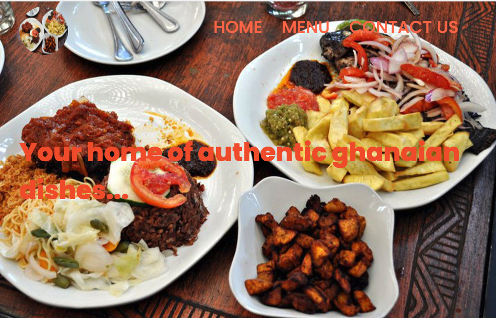
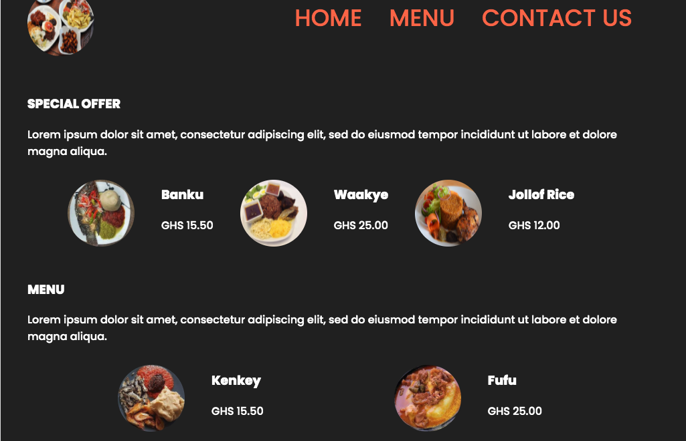
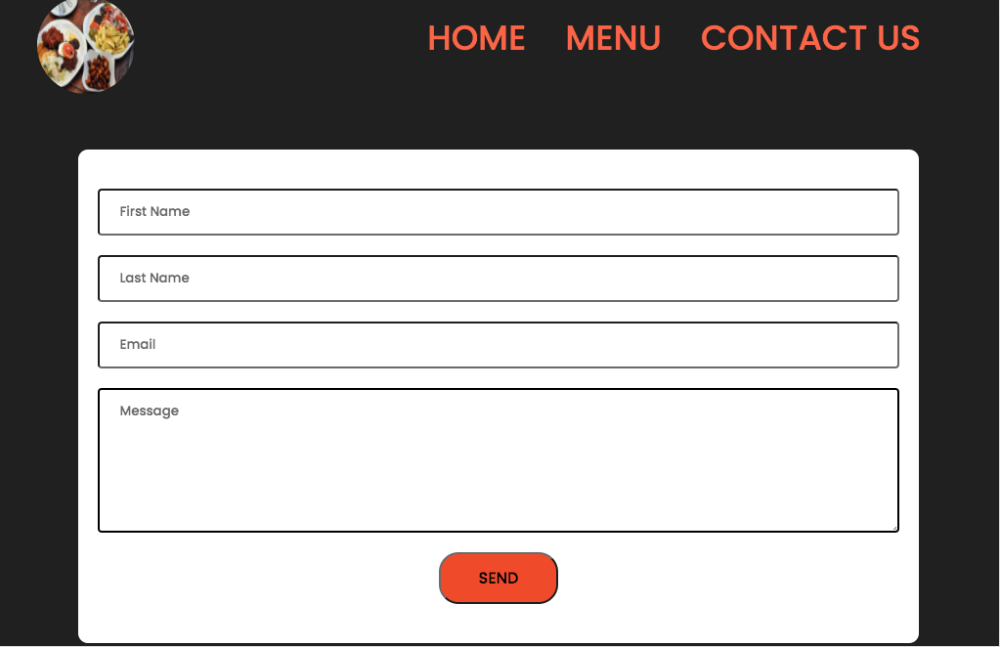

# restaurant-home-page
This project showcases DOM manipulation in rendering a page in Javascript using webpack and ES6.
Requirements can be seen from [The Odin Curriculum](https://www.theodinproject.com/courses/javascript/lessons/restaurant-page).

## Web App Screenshots
#### Home page

#### Menu page

#### Contact page

## Built With

- Javascript
- Html
- CSS
- Webpack

## Live Demo

Click [here](https://krys2fa.github.io/restaurant-home-page/) to visit a live version of the web app.

## Getting Started

To get a local copy up and running follow these simple example steps.

### Prerequisites

- npm
- webpack

### Setup
- Clone the repository.
- Run `npm install` to install dependencies.
- Run `npm start` to start the development server.
- Your browser should open. Click on the `dist` folder to see the app.

## Author

👤 **Christopher Amanor**

- Github: [@krys2fa](https://github.com/krys2fa)
- Twitter: [@krys2fa](https://twitter.com/krys2fa)
- Linkedin: [Christopher Amanor](https://www.linkedin.com/in/christopher-amanor/)

## 🤝 Contributing

Contributions, issues and feature requests are welcome!

Feel free to check the [issues page](https://github.com/krys2fa/restaurant-home-page/issues).

## Show your support

Kindly give this repository a ⭐️ if you like this project!

## Acknowledgments

- Project specifications by [Microverse](https://www.microverse.org) and [The Odin Project](https://www.theodinproject.com/courses/javascript/lessons/restaurant-page).

- [Design inspiration](https://www.behance.net/gallery/57230011/Sylhety-Restaurant-Web-App-Print-Template?tracking_source=search_projects_recommended%7Crestaurant%20web%20app%20design) was taken from Redwanul Haque.

- Images were downloaded from searches on [Google](https://www.google.com).

## 📝 License

This project is licensed under the MIT License.
